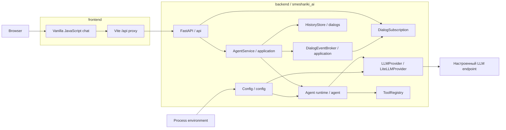

# Архитектура и контракты smeshariki-ai

Этот каталог помогает быстро найти архитектурные границы, пояснения по
фактической реализации и действующие контракты. Он не заменяет SDD-
спецификации: требования, сценарии, планы и доказательства проверки находятся
в [`specs/changes/`](../specs/changes/).

Если краткое описание расходится с последней согласованной спецификацией и её
результатом проверки, источником истины являются спецификация и
`verification.md`.

## Карта проекта

| Часть | Назначение | Где смотреть |
| --- | --- | --- |
| `frontend/` | Отдельное Vite-приложение чата с proxy к dialog/SSE API | [Frontend](../frontend/) |
| `backend/` | Единое приложение с HTTP API, application-слоем и runtime агента | [Backend](../backend/) |
| `docker/` | Контейнерный запуск backend и будущих инфраструктурных зависимостей | [Запуск и конфигурация](../docker/README.md) |
| `docs/` | Глобальная карта и тематические страницы архитектуры и контрактов | [Текущий каталог](./README.md) |
| `specs/` | Полные SDD-спецификации, планы, результаты проверки и реестр состояний | [SDD-артефакты](../specs/) |

## Тематические страницы

- [Агент](./agent.md) — `Agent`, `LLMProvider`, инструменты, `ToolRegistry` и
  ограничения agent loop.
- [Диалоги и HTTP API](./dialogs.md) — `AgentService`, `DialogEventBroker`,
  хранение истории, очередь запросов, SSE, HTTP и наблюдаемость.
- [Конфигурация backend](./configuration.md) — корневой `Config`, загрузка
  environment и передача component-owned подконфигов.
- [Запуск backend](../docker/README.md) — Docker Compose, настройки и примеры
  тестовых запросов.

## Архитектура

Backend является модульным монолитом. HTTP-слой вызывает application-сервис,
который координирует историю и независимый от транспорта runtime агента.

Сборка конкретных зависимостей выполняется в
[`bootstrap.py`](../backend/src/smeshariki_ai/bootstrap.py). Внутренние слои не
создают LLM-провайдер, реестр инструментов, хранилище или брокер событий
самостоятельно.

## Состояния компонентов

Краткий источник текущего состояния SDD-изменений —
[`specs/status.yaml`](../specs/status.yaml). Каталог использует такое
отображение статусов:

| Статус SDD | Состояние в каталоге | Значение |
| --- | --- | --- |
| `draft` | Специфицировано | Требования ещё не завершены или не согласованы |
| `in-queue` | Запланировано | Спецификация согласована и ожидает выполнения |
| `in-progress` | Реализуется | По изменению идёт активная работа |
| `done` | Проверено | Реализация прошла verify и имеет успешный `verification.md` |

| Компонент | Назначение | Состояние | Где реализация | Где конкретика |
| --- | --- | --- | --- | --- |
| Каркас проекта | Границы frontend, модульного backend и служебных каталогов | Проверено | [`frontend/`](../frontend/), [`backend/`](../backend/) | [spec](../specs/changes/project-scaffold/spec.md), [plan](../specs/changes/project-scaffold/plan.md), [verification](../specs/changes/project-scaffold/verification.md) |
| Frontend-чат | Vite proxy, создание диалога, отправка запроса и потоковое отображение SSE-ответа | Реализуется | [`frontend/src/`](../frontend/src/) | [описание](../frontend/README.md), [страница API](./dialogs.md), [integration spec](../specs/changes/frontend-agent-integration/spec.md), [integration plan](../specs/changes/frontend-agent-integration/plan.md), [integration verification](../specs/changes/frontend-agent-integration/verification.md) |
| Agent runtime | Собственный ограниченный tool-calling loop и независимые контракты LLM и инструментов | Проверено | [`smeshariki_ai/agent`](../backend/src/smeshariki_ai/agent/) | [страница компонента](./agent.md), [spec](../specs/changes/agent-runtime/spec.md), [plan](../specs/changes/agent-runtime/plan.md), [verification](../specs/changes/agent-runtime/verification.md) |
| LiteLLM-провайдер | Асинхронный production-адаптер Chat Completions и отдельная provider-конфигурация | Проверено | [`agent/providers`](../backend/src/smeshariki_ai/agent/providers/) | [страница компонента](./agent.md), [spec](../specs/changes/litellm-provider/spec.md), [plan](../specs/changes/litellm-provider/plan.md), [verification](../specs/changes/litellm-provider/verification.md) |
| Конфигурация backend | Единая загрузка environment, корневой immutable `Config` и раздача подконфигов | Проверено | [`config.py`](../backend/src/smeshariki_ai/config.py), [`main.py`](../backend/src/smeshariki_ai/main.py), [`bootstrap.py`](../backend/src/smeshariki_ai/bootstrap.py) | [страница компонента](./configuration.md), [spec](../specs/changes/backend-config/spec.md), [plan](../specs/changes/backend-config/plan.md), [verification](../specs/changes/backend-config/verification.md) |
| Диалоги и HTTP API | Создание диалогов, фоновая очередь сообщений, история и HTTP-вход | Проверено | [`application`](../backend/src/smeshariki_ai/application/), [`dialogs`](../backend/src/smeshariki_ai/dialogs/), [`api`](../backend/src/smeshariki_ai/api/) | [страница компонента](./dialogs.md), [spec](../specs/changes/agent-dialog-api/spec.md), [plan](../specs/changes/agent-dialog-api/plan.md), [verification](../specs/changes/agent-dialog-api/verification.md) |
| Streaming, SSE и тестовый UI | Поток LiteLLM и агента, in-memory SSE-подписки и `/agent_test` | Проверено | [`agent`](../backend/src/smeshariki_ai/agent/), [`application`](../backend/src/smeshariki_ai/application/), [`api`](../backend/src/smeshariki_ai/api/) | [страница агента](./agent.md), [страница API](./dialogs.md), [spec](../specs/changes/agent-sse-test-ui/spec.md), [plan](../specs/changes/agent-sse-test-ui/plan.md), [verification](../specs/changes/agent-sse-test-ui/verification.md) |
| Брокер событий диалога | Абстракция pub/sub и process-local реализация ограниченных SSE-очередей | Проверено | [`event_broker.py`](../backend/src/smeshariki_ai/application/event_broker.py) | [страница компонента](./dialogs.md), [spec](../specs/changes/dialog-event-broker/spec.md), [plan](../specs/changes/dialog-event-broker/plan.md), [verification](../specs/changes/dialog-event-broker/verification.md) |

Прогресс отдельных задач здесь не ведётся: он остаётся в соответствующих SDD-
артефактах.

## Что пока не реализовано

Production deployment и reverse proxy frontend, RAG и инструмент
`search_knowledge`, CORS, постоянное хранилище истории, replay SSE-событий и
авторизация относятся к будущим изменениям. Существующая локальная интеграция
через Vite proxy или согласованное архитектурное направление не означают, что
эти возможности уже доступны.
