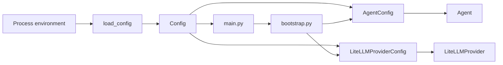

# Конфигурация backend

[← Глобальный каталог](./README.md)

Backend загружает внешнюю конфигурацию через один публичный модуль
[`smeshariki_ai.config`](../backend/src/smeshariki_ai/config.py). Его контракт
состоит из immutable-корня `Config` и функции `load_config`:

```python
class Config(BaseModel):
    agent: AgentConfig
    llm: LiteLLMProviderConfig

def load_config(environ: Mapping[str, str] | None = None) -> Config: ...
```

`Config` — общий агрегат настроек, но не глобальный singleton. Он создаётся на
внешней границе процесса, после чего bootstrap передаёт компонентам только
принадлежащие им подконфиги.

## Поток конфигурации



ASGI-entrypoint выполняет `create_application(load_config())`: один раз читает
environment и передаёт готовый корень в composition root. `bootstrap.py` не
имеет собственного loader и не подставляет defaults при отсутствии config.
`Agent` получает тот же экземпляр `config.agent`, а `LiteLLMProvider` — тот же
экземпляр `config.llm`.

Внутренние пакеты `agent`, `agent.providers`, `application`, `api` и `dialogs`
не импортируют корневой `Config` и не читают environment. Поэтому их можно
создавать и тестировать с явными зависимостями без состояния процесса.

## Источники и значения

При вызове без аргумента `load_config()` читает `os.environ`. Переданный
`Mapping[str, str]` полностью заменяет этот источник; это позволяет
детерминированно проверять загрузку без изменения process environment.

| Переменная | Подконфиг и поле | Обязательность / default |
| --- | --- | --- |
| `AGENT_SYSTEM_PROMPT` | `agent.system_prompt` | `You are a helpful Smeshariki assistant.` |
| `AGENT_MAX_ITERATIONS` | `agent.max_iterations` | `4`, целое число больше нуля |
| `LLM_MODEL` | `llm.model` | Обязательная непустая строка |
| `LLM_API_KEY` | `llm.api_key` | `None`; пустое значение нормализуется в `None` |
| `LLM_BASE_URL` | `llm.base_url` | `None`; при наличии HTTP(S) URL |
| `LLM_TIMEOUT_SECONDS` | `llm.timeout_seconds` | `60`, число больше нуля |
| `LLM_NUM_RETRIES` | `llm.num_retries` | `0`, целое число не меньше нуля |

Docker Compose загружает локальный `docker/.env` и передаёт значения процессу
backend. Python-код не читает `.env` как файл и не использует
`pydantic-settings` или dotenv-библиотеку. Полный контейнерный контракт описан
в [руководстве Docker](../docker/README.md).

## Владение и валидация

- `AgentConfig` принадлежит пакету [`agent`](./agent.md) и определяет только
  настройки runtime агента.
- `LiteLLMProviderConfig` принадлежит `agent.providers` и определяет только
  настройки адаптера LiteLLM.
- Корневой `Config` агрегирует эти модели, но не дублирует их поля.
- Все модели запрещают неизвестные поля и изменение после создания.
- API key хранится как `SecretStr` и не раскрывается в строковом представлении
  конфигурации.
- Невалидная или неполная конфигурация завершает старт до создания
  FastAPI-приложения; production fallback на fake-провайдер отсутствует.

При добавлении нового настраиваемого компонента его модель остаётся в модуле
владельца. Корневой `Config` получает новый типизированный подконфиг,
`load_config` собирает его из согласованного внешнего источника, а bootstrap
передаёт компоненту только этот подконфиг. Новые источники, форматы файлов и
reload во время работы требуют отдельного SDD-изменения.

## Связанные SDD-артефакты

- [Спецификация](../specs/changes/backend-config/spec.md)
- [План](../specs/changes/backend-config/plan.md)
- [Результат проверки](../specs/changes/backend-config/verification.md)
