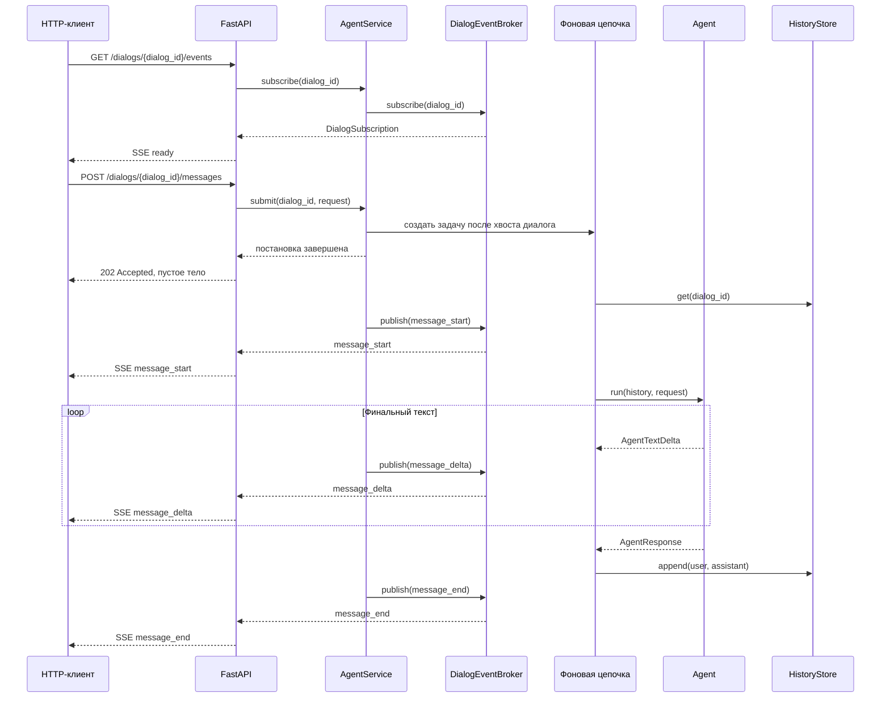

# Диалоги и HTTP API

[← Глобальный каталог](./README.md)

Диалоговый слой связывает HTTP API с независимым runtime агента. Прикладная
координация находится в `application`, хранение истории — в `dialogs`, а
FastAPI-маршруты только валидируют HTTP-ввод и преобразуют ошибки.

## Где находится реализация

- [`application/agent_service.py`](../backend/src/smeshariki_ai/application/agent_service.py)
  — очередь запусков и `AgentService`;
- [`application/event_broker.py`](../backend/src/smeshariki_ai/application/event_broker.py)
  — контракт `DialogEventBroker` и process-local реализация
  `InMemoryDialogEventBroker`;
- [`application/events.py`](../backend/src/smeshariki_ai/application/events.py)
  — типы событий и потребительский контракт подписки;
- [`dialogs/history.py`](../backend/src/smeshariki_ai/dialogs/history.py) —
  контракт истории и in-memory реализация;
- [`api/app.py`](../backend/src/smeshariki_ai/api/app.py) — HTTP-маршруты и
  shutdown lifecycle;
- [`api/schemas.py`](../backend/src/smeshariki_ai/api/schemas.py) — схемы HTTP-
  запросов и ответов;
- [`api/agent_test.html`](../backend/src/smeshariki_ai/api/agent_test.html) —
  самодостаточный тестовый интерфейс;
- [`bootstrap.py`](../backend/src/smeshariki_ai/bootstrap.py) — сборка готовых
  зависимостей приложения.

## Внутренние контракты

```python
AgentService(
    agent: AgentRunner,
    history_store: HistoryStore,
    event_broker: DialogEventBroker,
)
await AgentService.start_dialog() -> UUID
await AgentService.submit(dialog_id: UUID, request: UserRequest) -> None
await AgentService.subscribe(dialog_id: UUID) -> DialogSubscription
await AgentService.unsubscribe(subscription: DialogSubscription) -> None
await AgentService.shutdown() -> None

await DialogEventBroker.subscribe(dialog_id: UUID) -> DialogSubscription
await DialogEventBroker.unsubscribe(subscription: DialogSubscription) -> None
await DialogEventBroker.publish(dialog_id: UUID, event: DialogEvent) -> None
await DialogEventBroker.shutdown() -> None
```

`start_dialog` создаёт пустую историю и возвращает UUIDv4. Возврат из `submit`
означает только то, что фоновая задача создана в текущем процессе; метод не ждёт
ответа агента.

Для одного `dialog_id` сервис хранит хвост цепочки `asyncio.Task`: следующий
запуск ожидает предыдущий и только затем читает обновлённую историю. Разные
диалоги имеют независимые цепочки и могут выполняться параллельно. Очередь не
ограничена по длине и не сохраняется после перезапуска.

`AgentService` проверяет существование диалога и состояние lifecycle, после чего
делегирует открытие, закрытие и доставку событий внедрённому
`DialogEventBroker`. Сервис не хранит подписчиков и не знает об устройстве их
очередей.

Production composition root создаёт один `InMemoryDialogEventBroker` на
экземпляр приложения. Он ведёт независимые наборы подписчиков по `dialog_id` и
публикует им `message_start`, `message_delta`, `message_end` или
`message_error`. Очередь каждого подписчика ограничена 64 событиями:
переполненная или отключённая подписка удаляется и не создаёт backpressure для
агента. События не сохраняются для replay; подключившийся клиент видит только
будущие события. Брокер не зависит от FastAPI, агента и `HistoryStore`.

```python
await HistoryStore.create() -> UUID
await HistoryStore.get(dialog_id: UUID) -> tuple[Message, ...]
await HistoryStore.append(
    dialog_id: UUID,
    messages: Sequence[Message],
) -> None
```

`get` возвращает неизменяемый снимок. `append` атомарно добавляет группу
сообщений. После успешного запуска сервис сохраняет одной операцией только
пользовательское и финальное сообщения ассистента. При ошибке агента история не
меняется; tool calls и tool results в историю диалога не попадают.

## Поток сообщения



## HTTP-контракты

Базовый префикс API — `/api/v1`.

| Запрос | Успешный ответ | Ошибки |
| --- | --- | --- |
| `POST /api/v1/dialogs` без тела | `201 Created`, `Location: /api/v1/dialogs/<uuid>`, JSON `{"dialog_id":"<uuid>"}` | `503 Service Unavailable`, если сервис больше не принимает запросы |
| `POST /api/v1/dialogs/{dialog_id}/messages` с JSON `{"request":"<непустой текст>"}` | Немедленный `202 Accepted` с пустым телом после создания фоновой задачи | `404 Not Found` для неизвестного диалога; `422 Unprocessable Entity` для некорректного UUID, пустого текста или лишних полей; `503 Service Unavailable`, если задачу нельзя принять |
| `GET /api/v1/dialogs/{dialog_id}/events` | `200 OK`, `text/event-stream`, начальное `ready`, heartbeat и будущие `message_*` events | `404 Not Found` для неизвестного диалога; `422 Unprocessable Entity` для некорректного UUID; `503 Service Unavailable` после остановки сервиса |
| `GET /agent_test` | `200 OK`, один самодостаточный HTML с тестовым чатом | Стандартная ошибка FastAPI при недоступности приложения |

`dialog_id` всегда передаётся в URL и не является средством авторизации. Cookie
для выбора диалога не создаются и не читаются.

SSE events содержат JSON: `ready` передаёт `dialog_id`, `message_delta` —
непустой `delta`, `message_error` — безопасные `code` и `message`, а
`message_start` и `message_end` используют пустой объект. Tool calls, tool
results и история через поток не выдаются. `Last-Event-ID` не поддерживается:
после переподключения replay отсутствует. API чтения истории и CORS middleware
по-прежнему не реализованы.

`/agent_test` создаёт новый диалог, открывает `EventSource`, отправляет сообщения
в существующую POST-ручку и постепенно дополняет ответ. Страница состоит из
одного HTML с встроенными CSS и vanilla JavaScript, не загружает внешние ресурсы
и вставляет запросы и ответы в DOM как текст.

## Наблюдаемость и lifecycle

Сервис журналирует создание диалога, принятие запроса, начало и завершение
фонового запуска, сохранение истории, отмену и тип ошибки с привязкой к
`dialog_id`. Вместе с событиями runtime это позволяет увидеть каждую итерацию и
статус инструмента. Текст запроса, история, ответы, tool payload, секреты и текст
исключения не журналируются.

При штатном shutdown сервис прекращает принимать новые запросы, отменяет все
отслеживаемые фоновые задачи и ожидает их завершения, после чего вызывает
`DialogEventBroker.shutdown()`. Брокер закрывает подписки и разблокирует
ожидающих потребителей. Повторные unsubscribe и shutdown безопасны. История,
очереди и события находятся только в памяти процесса и после перезапуска
теряются.

## Где искать подробности

- [спецификация](../specs/changes/agent-dialog-api/spec.md);
- [план](../specs/changes/agent-dialog-api/plan.md);
- [результат проверки](../specs/changes/agent-dialog-api/verification.md);
- [спецификация streaming и SSE](../specs/changes/agent-sse-test-ui/spec.md);
- [план streaming и SSE](../specs/changes/agent-sse-test-ui/plan.md);
- [результат проверки streaming и SSE](../specs/changes/agent-sse-test-ui/verification.md);
- [спецификация брокера событий](../specs/changes/dialog-event-broker/spec.md);
- [план брокера событий](../specs/changes/dialog-event-broker/plan.md);
- [результат проверки брокера событий](../specs/changes/dialog-event-broker/verification.md);
- [запуск и тестовые HTTP-запросы](../docker/README.md).
