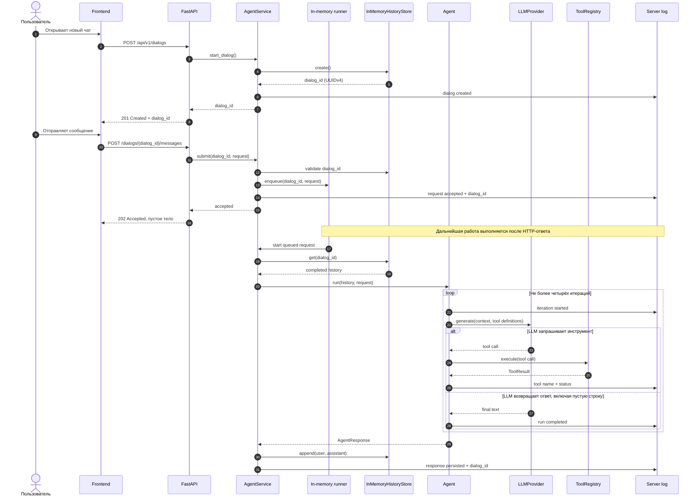

# Диалоги агента, in-memory история и фоновый HTTP-запуск

## Цель

Добавить прикладной `AgentService` как единую точку входа для создания диалога
и запуска агента, временное in-memory хранилище истории и минимальный FastAPI
интерфейс для frontend. Клиент явно создаёт диалог, получает серверный
`dialog_id` в формате UUID и передаёт его при отправке каждого сообщения.

HTTP-ручка сообщения должна только проверить и принять запрос, запустить agent
loop в фоне и сразу вернуть пустой ответ, не ожидая результата агента. Ход и
результат фонового запуска доступны только в безопасных логах backend. Получение
ответа клиентом и переход на SSE относятся к будущему изменению.

Эта спецификация зависит от согласованной и реализованной спецификации
`specs/changes/agent-runtime/spec.md`.

## Допущения

- Первая версия не содержит пользователей, аутентификации и cookie-сессий.
- `dialog_id` идентифицирует диалог, но не является механизмом авторизации.
- Идентификаторы создаются backend с помощью UUIDv4.
- История, очередь запусков и выполняющиеся задачи находятся в памяти одного
  процесса и теряются при его перезапуске.
- Frontend не изменяется: выбор его стека и реализация хранения `dialog_id`
  требуют отдельной спецификации.
- CORS не настраивается до появления спецификации frontend.
- Потоковая передача и SSE не входят в первую версию API.
- До подключения реального LLM backend использует `FakeLLMProvider`, который
  завершает фоновый agent loop успешным пустым ответом без tool calls и ошибок.
- Первая версия не предоставляет HTTP-ручку для получения результата фонового
  запуска или истории диалога.

## Требования

- REQ-001: Должна существовать абстракция `HistoryStore` с асинхронными
  операциями создания диалога, чтения истории и добавления сообщений.
- REQ-002: `InMemoryHistoryStore` должен создавать уникальный UUIDv4, хранить
  независимую последовательность сообщений для каждого `dialog_id` и возвращать
  контролируемую ошибку для неизвестного идентификатора.
- REQ-003: Должен существовать `AgentService`, создаваемый с готовыми `Agent` и
  `HistoryStore`. Он не должен зависеть от FastAPI и самостоятельно читать
  переменные окружения.
- REQ-004: `AgentService.start_dialog()` должен создать пустой диалог в
  `HistoryStore` и вернуть его `dialog_id`.
- REQ-005: `AgentService.submit(dialog_id, request)` должен проверить
  существование диалога, поставить запуск агента в in-memory очередь этого
  диалога и вернуть управление, не ожидая выполнения `Agent.run`.
- REQ-006: Фоновая обработка должна загрузить завершённую историю диалога,
  вызвать `Agent.run(history, request)` и только после успешного завершения
  сохранить пользовательское и финальное сообщения в исходном порядке.
- REQ-007: Внутренние сообщения agent loop, включая tool calls и результаты
  инструментов, не должны сохраняться как пользовательская история или
  возвращаться клиенту.
- REQ-008: При ошибке фонового запуска пользовательское сообщение и
  незавершённый ответ не должны добавляться в историю. Ошибка фиксируется в
  серверном журнале и не может изменить уже отправленный HTTP-ответ.
- REQ-009: Запросы к одному диалогу должны ставиться в очередь и запускаться
  последовательно, чтобы каждый следующий агент видел результат предыдущего.
  Запуски разных диалогов не должны блокировать друг друга.
- REQ-010: Все созданные фоновые задачи должны отслеживаться приложением. При
  штатной остановке backend должен прекратить принимать новые запросы и
  корректно завершить либо отменить оставшиеся задачи без необработанных
  исключений.
- REQ-011: Сборка приложения должна находиться вне `AgentService`: bootstrap
  загружает конфигурацию, создаёт `FakeLLMProvider`, `ToolRegistry`, `Agent`,
  `InMemoryHistoryStore` и передаёт готовые зависимости сервису.
- REQ-012: `AgentService` должен журналировать создание диалога, принятие
  запроса, начало и завершение фонового запуска, успешное сохранение ответа,
  отмену и ошибку с привязкой к `dialog_id`. Полный текст запроса, история,
  содержимое tool calls и секреты в лог не записываются.
- REQ-013: `POST /api/v1/dialogs` без тела должен вызвать
  `AgentService.start_dialog()` и вернуть `201 Created`, заголовок `Location` и
  JSON `{"dialog_id": "<uuid>"}`.
- REQ-014: `POST /api/v1/dialogs/{dialog_id}/messages` должен принимать JSON
  `{"request": "<непустой текст>"}`, вызвать `AgentService.submit` и после
  постановки запуска в очередь сразу вернуть `202 Accepted` с пустым телом.
- REQ-015: HTTP-ручка сообщения не должна ожидать завершения `Agent.run` и не
  должна возвращать финальный текст, tool calls, прогресс или ошибку фонового
  агента. Штатный пустой результат `FakeLLMProvider` доступен только в истории и
  серверном журнале.
- REQ-016: Неизвестный либо потерянный после перезапуска `dialog_id` должен
  приводить к `404 Not Found`. Синтаксически некорректный UUID или пустой запрос
  должен приводить к `422 Unprocessable Entity`; фоновая задача в этих случаях
  не создаётся.
- REQ-017: Если валидный запрос невозможно поставить в очередь до отправки
  HTTP-ответа, API должен вернуть безопасный JSON-ответ
  `503 Service Unavailable`. Ошибки, возникшие после принятия запроса, доступны
  только в серверном журнале.
- REQ-018: API не должен создавать или читать cookie для выбора диалога.
  Передача `dialog_id` в cookie, заголовке и теле сообщения не заменяет
  обязательный идентификатор в пути.
- REQ-019: Первая версия не должна добавлять CORS middleware, SSE,
  `StreamingResponse` или другие потоковые HTTP-ответы.
- REQ-020: Минимальное backend-приложение должно запускаться командой
  `make run`. Контейнерные файлы находятся только в `docker/`, Compose не
  включает frontend, а локальные секреты не попадают в Git.
- REQ-021: `make test` должен проверять сервисный и HTTP-контракты с
  детерминированными doubles без сети и успешно завершаться.
- REQ-022: `AGENTS.md` должен быть актуализирован по результатам изменения и
  закреплять роли `AgentService` и `HistoryStore`, создание UUIDv4
  `dialog_id`, обязательную передачу идентификатора в URL, фоновый запуск с
  немедленным пустым HTTP-ответом, серверное логирование agent loop, in-memory
  ограничения и отсутствие cookie, CORS и SSE.

## Сценарии

### Создание диалога и принятие первого сообщения

- Given backend запущен и не содержит диалогов
- When клиент вызывает `POST /api/v1/dialogs`
- Then backend создаёт пустой диалог и возвращает уникальный UUIDv4
- When клиент отправляет непустой запрос по адресу этого диалога
- Then сервис ставит запуск агента в очередь этого диалога
- And API возвращает `202 Accepted` с пустым телом до завершения agent loop
- And ответ не содержит результата, ошибки или внутренних шагов агента
- When фоновый agent loop успешно завершается
- Then история содержит пользовательский запрос и пустой финальный ответ
- And этапы обработки доступны в серверных логах

### Немедленный ответ при незавершённом агенте

- Given тестовый `LLMProvider` заблокирован до внешнего сигнала
- When клиент отправляет корректное сообщение
- Then HTTP-ручка возвращает `202 Accepted` с пустым телом, пока провайдер всё
  ещё заблокирован
- And после разблокировки провайдера фоновый запуск завершается независимо от
  HTTP-запроса

### Продолжение существующего диалога

- Given в один диалог приняты два пользовательских запроса
- And первый agent loop ещё не завершён
- When фоновый обработчик выполняет очередь
- Then второй запуск начинается только после завершения первого
- And второй агент получает историю, сохранённую первым запуском

### Неизвестный диалог

- Given `dialog_id` отсутствует в текущем in-memory хранилище
- When клиент отправляет в него сообщение
- Then backend отвечает `404 Not Found`
- And фоновая задача не создаётся

### Ошибка фонового агента

- Given существует пустой диалог
- And тестовый агент настроен завершиться контролируемой ошибкой
- When клиент отправляет сообщение
- Then API уже возвращает `202 Accepted` с пустым телом
- And серверный журнал содержит статус ошибки и `dialog_id`
- And история диалога остаётся пустой

### Параллельные диалоги

- Given существуют два диалога
- When в каждый из них почти одновременно поступает сообщение
- Then оба HTTP-запроса сразу получают `202 Accepted`
- And фоновые запуски разных диалогов могут выполняться независимо

## Процесс работы с диалогом

## Технологии и структура

- Python 3.12, `uv`, FastAPI, Pydantic и Pytest.
- Стандартные `asyncio` и `logging` используются для фоновых задач,
  синхронизации очередей и безопасного журналирования.
- In-memory реализация использует структуры текущего процесса и отдельную
  синхронизацию по `dialog_id`; внешний брокер задач и база данных не
  добавляются.
- HTTP-слой размещается в `backend/src/smeshariki_ai/api/`, сервисный интерфейс
  остаётся внутри backend и не импортирует FastAPI.
- Точка сборки приложения создаёт зависимости один раз на жизненный цикл
  процесса и подключает корректное завершение фоновых задач к lifecycle
  FastAPI.
- Контейнерный запуск backend описывается файлами в `docker/`; frontend остаётся
  вне Compose.
- Реализованный жизненный цикл диалога и границы сервисного слоя фиксируются в
  корневом `AGENTS.md`.

Конкретные файлы, версии совместимых зависимостей, команда ASGI-сервера, способ
ведения очередей, политика остановки задач, формат логов и имена настроек
определяются в плане и фиксируются `uv.lock` и `docker/.env.example`. Реальный
LLM SDK, Qdrant, RAG, внешний task broker, CORS и SSE в изменение не входят.

## Команды

- Запуск: `make run` поднимает backend через Compose-файлы из `docker/`.
- Тесты: `make test` запускает полный набор продуктовых Python-тестов через
  `uv`.

## Тестирование

| Требования | Способ проверки |
| --- | --- |
| REQ-001–REQ-002 | Модульные тесты создания, чтения, изоляции и неизвестного диалога |
| REQ-003–REQ-012 | Модульные async-тесты `AgentService`, очередей, порядка истории, фоновых ошибок, остановки задач и безопасных логов |
| REQ-013–REQ-019 | HTTP-тесты FastAPI на создание диалога, немедленный `202` с пустым телом, коды ошибок и отсутствие потокового ответа |
| REQ-020 | Smoke-проверка запуска `make run` и ревью Compose без frontend; секреты проверяются ревью, а не структурным автотестом |
| REQ-021 | Запуск `make test` без сети и внешней модели |
| REQ-022 | Ревью актуализированного `AGENTS.md`; отдельный тест документации не добавляется |

Для проверки немедленного ответа тестовый LLM блокируется управляемым событием:
HTTP-запрос обязан завершиться до снятия блокировки. Затем тест освобождает
провайдер и дожидается фоновой задачи через контролируемый lifecycle сервиса.
Тесты проверяют поведение продукта, а не только наличие файлов конфигурации.

## Границы

- Всегда: использовать `dialog_id` в URL; принимать запрос только после его
  постановки в очередь; выполнять запросы одного диалога по порядку; сохранять
  историю только после успешного ответа; отслеживать фоновые задачи; отражать
  их жизненный цикл в безопасном серверном журнале.
- Сначала спросить: добавить пользователя или cookie-сессию; хранить историю в
  базе; подключить внешний task broker; добавить получение результата или
  истории; реализовать удаление либо восстановление диалога; добавить CORS, SSE
  или потоковую передачу токенов.
- Никогда: считать UUID авторизацией; включать frontend в Compose; возвращать
  внутренние tool-сообщения клиенту; сохранять их как пользовательскую историю;
  логировать содержимое запросов, истории, аргументов и результатов
  инструментов или секреты; коммитить секреты.

## Критерии приёмки

- [ ] Новый диалог создаётся через `POST /api/v1/dialogs`, получает уникальный
  UUIDv4 и имеет пустую историю.
- [ ] Валидное сообщение ставится в очередь, после чего HTTP-ручка немедленно
  возвращает `202 Accepted` с пустым телом, не ожидая `Agent.run`.
- [ ] HTTP-ответ не содержит результата, прогресса или ошибки фонового агента.
- [ ] Штатный `FakeLLMProvider` успешно завершает фоновый запуск пустым ответом,
  а история затем содержит пользовательское и пустое финальное сообщения.
- [ ] Запросы одного диалога выполняются последовательно и получают завершённую
  историю предыдущих запусков; разные диалоги не блокируют друг друга.
- [ ] Неизвестные и некорректные идентификаторы различаются ответами `404` и
  `422`; cookie для выбора диалога не используется.
- [ ] Фоновая ошибка не изменяет историю, не влияет на уже отправленный ответ и
  наблюдаема в безопасном серверном журнале.
- [ ] Все фоновые задачи отслеживаются и не оставляют необработанных исключений
  при штатной остановке приложения.
- [ ] Все итерации agent loop и их результаты наблюдаемы в серверных логах без
  записи пользовательского содержимого, tool payload и секретов.
- [ ] В приложении отсутствуют CORS middleware и потоковые HTTP-ответы.
- [ ] `make run` запускает только backend и разрешённые инфраструктурные
  зависимости, не включая frontend.
- [ ] `make test` проходит успешно без сети, реального LLM, Qdrant и RAG.
- [ ] `AGENTS.md` соответствует реализованным ролям сервиса и хранилища,
  асинхронному контракту постановки запросов в очередь и ограничениям in-memory
  версии.

## Открытые вопросы

- Нет.
