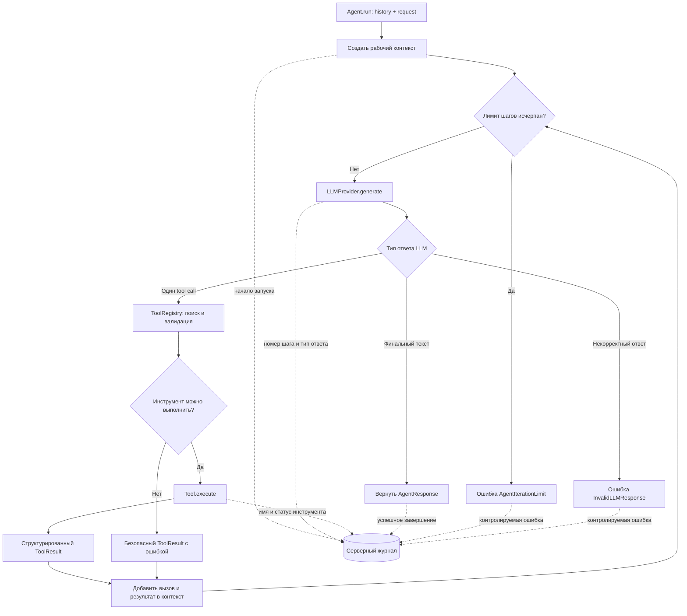

# Минимальный runtime агента с собственным tool-calling loop

## Цель

Создать внутри backend независимый от HTTP runtime агента, который принимает
историю диалога и новый запрос, обращается к абстрактному LLM-провайдеру и при
необходимости выполняет зарегистрированные инструменты. Оркестрация реализуется
собственным небольшим циклом без LangChain и LangGraph, чтобы поведение было
прозрачным, заменяемым и детерминированно тестируемым.

## Допущения

- Runtime работает асинхронно на Python 3.12.
- `Agent` получает две обязательные runtime-зависимости: `LLMProvider` и
  `ToolRegistry`. Неизменяемый `AgentConfig` с системной инструкцией и лимитом
  итераций передаётся отдельно как конфигурационное значение.
- Первая версия допускает не более одного вызова инструмента в одном ответе LLM
  и не более четырёх итераций agent loop.
- Реальный LLM-провайдер и настоящий `search_knowledge` не входят в изменение.
  Для локального запуска `FakeLLMProvider` всегда возвращает корректный пустой
  финальный ответ без tool calls и ошибок. Другие ветви loop проверяются
  сценарными тестовыми doubles.
- История диалогов, `AgentService` и HTTP относятся к следующему зависимому
  изменению `agent-dialog-api`.

## Требования

- REQ-001: Должен существовать класс `Agent`, создаваемый с `LLMProvider`,
  `ToolRegistry` и конфигурацией агента; он не должен самостоятельно читать
  переменные окружения или создавать эти зависимости.
- REQ-002: Асинхронный метод `Agent.run(history, request)` должен принимать
  последовательность ранее сохранённых доменных сообщений и новый запрос
  пользователя, не изменяя переданную историю, и возвращать структурированный
  `AgentResponse`.
- REQ-003: При каждом шаге `Agent` должен передавать LLM рабочий контекст и
  описания доступных инструментов. Финальный текст LLM должен завершать цикл и
  становиться ответом агента.
- REQ-004: Если LLM запрашивает инструмент, `Agent` должен выполнить его только
  через `ToolRegistry`, добавить вызов и структурированный результат инструмента
  в рабочий контекст и повторно обратиться к LLM.
- REQ-005: Agent loop должен завершаться контролируемой ошибкой после четырёх
  итераций без финального ответа и никогда не выполняться бесконечно.
- REQ-006: Пустая строка должна считаться корректным финальным текстом. Ответ
  LLM, одновременно содержащий финальный текст и вызов инструмента, несколько
  вызовов инструментов либо не содержащий ни поля финального текста, ни вызова
  инструмента, должен считаться некорректным и приводить к контролируемой ошибке.
- REQ-007: `LLMProvider` должен быть асинхронной внутренней абстракцией над
  генерацией ответа и использовать только доменные модели проекта. Типы и
  форматы SDK конкретного поставщика не должны проникать в `Agent`.
- REQ-008: `FakeLLMProvider` должен без обращения к сети возвращать корректный
  финальный ответ с пустой строкой, без tool calls и без ошибки. Сценарные
  тестовые реализации `LLMProvider` должны позволять проверить остальные ветви
  agent loop без внешней модели.
- REQ-009: Любой инструмент должен быть экземпляром класса, унаследованного от
  абстрактного `Tool`, и предоставлять уникальное имя, описание, Pydantic-схему
  аргументов и асинхронное выполнение с результатом `ToolResult`.
- REQ-010: `ToolRegistry` должен создаваться из последовательности экземпляров
  `Tool`, допускать пустую последовательность, отклонять повторяющиеся имена,
  предоставлять LLM описания инструментов и находить инструмент по имени.
- REQ-011: Перед выполнением инструмента реестр должен валидировать аргументы по
  его Pydantic-схеме. Неизвестный инструмент или невалидные аргументы не должны
  приводить к выполнению произвольного кода; агент должен получить безопасный
  структурированный результат ошибки и иметь возможность продолжить цикл.
- REQ-012: Исключение при выполнении инструмента не должно раскрывать traceback
  или внутренние данные модели. Оно преобразуется в безопасный результат ошибки
  для LLM, а технические детали доступны только серверному журналу.
- REQ-013: Runtime не должен зависеть от LangChain, LangGraph или другого
  фреймворка оркестрации агентов.
- REQ-014: `make test` должен запускать все продуктовые Python-тесты через `uv`
  и успешно проверять поведение agent loop, LLM-абстракции и реестра
  инструментов.
- REQ-015: `AGENTS.md` должен быть актуализирован по результатам изменения и
  закреплять `Agent`, `LLMProvider`, `ToolRegistry`, наследование инструментов от
  `Tool`, собственный ограниченный tool-calling loop и отсутствие LangChain и
  LangGraph в первой версии.
- REQ-016: Agent loop должен журналировать начало запуска, номер каждой
  итерации, тип результата LLM, имя и статус вызванного инструмента, успешное
  завершение и контролируемую ошибку. Логи не должны содержать полный текст
  истории и запроса, аргументы или результат инструмента, секреты и traceback в
  пользовательском сообщении.

## Сценарии

### Ответ без инструмента

- Given агент использует `FakeLLMProvider`
- And агент получил историю и новый запрос
- When вызывается `Agent.run`
- Then провайдер получает историю, новый запрос и описания инструментов
- And агент возвращает успешный `AgentResponse` с пустым финальным текстом
- And запуск и завершение отражены в серверном журнале
- And исходная история остаётся неизменной

### Вызов зарегистрированного инструмента

- Given в реестре зарегистрирован тестовый инструмент
- And первый ответ сценарного тестового провайдера содержит корректный вызов
  этого инструмента
- And второй ответ содержит финальный текст
- When вызывается `Agent.run`
- Then инструмент выполняется ровно один раз с валидированными аргументами
- And второй вызов LLM содержит вызов инструмента и его результат
- And агент возвращает финальный текст второго ответа

### Неизвестный или некорректно вызванный инструмент

- Given LLM запросил отсутствующий инструмент либо передал невалидные аргументы
- When агент обрабатывает вызов
- Then никакой инструмент не выполняется с этими аргументами
- And в рабочий контекст добавляется безопасный структурированный результат
  ошибки
- And цикл может продолжиться до финального ответа или лимита итераций

### Превышение лимита

- Given сценарный тестовый провайдер на каждом шаге запрашивает инструмент и не
  возвращает финальный ответ
- When агент достигает четвёртой итерации
- Then выполнение завершается контролируемой ошибкой лимита
- And пятого обращения к LLM не происходит

## Процесс agent loop

## Технологии и структура

- Python 3.12 и `src`-layout существующего пакета `smeshariki_ai`.
- `uv` для зависимостей, lock-файла и запуска Python-команд.
- Pydantic для доменных сообщений, конфигурации, аргументов и результатов.
- Стандартные `abc`, `typing` и `asyncio` для контрактов и асинхронного runtime.
- Стандартный модуль `logging` для безопасного журнала шагов agent loop.
- Pytest для модульных тестов; async-поддержка выбирается в плане совместимо с
  утверждённой версией Pytest.
- Реализация размещается внутри `backend/src/smeshariki_ai/agent/`; тестовые
  doubles и тестовые инструменты не становятся частью публичного API.
- Архитектурные правила, подтверждённые реализацией, фиксируются в корневом
  `AGENTS.md` без преждевременного описания компонентов следующих изменений.

Конкретные файлы и версии зависимостей определяются в плане этой спецификации и
фиксируются `uv.lock`. SDK облачного LLM-провайдера не добавляется.

## Команды

- Запуск: `make run` не меняется, потому что runtime ещё не имеет HTTP-точки
  входа; запускаемое приложение появится в `agent-dialog-api`.
- Тесты: `make test` запускает продуктовые Python-тесты backend через `uv`.

## Тестирование

| Требования | Способ проверки |
| --- | --- |
| REQ-001–REQ-004 | Модульные тесты `Agent` со сценарным тестовым провайдером и тестовым инструментом |
| REQ-005–REQ-006 | Модульные тесты лимита итераций и некорректных ответов LLM |
| REQ-007–REQ-008 | Контрактные тесты детерминированного `FakeLLMProvider` без сети |
| REQ-009–REQ-012 | Модульные тесты регистрации, валидации, неизвестного имени и исключения инструмента |
| REQ-013 | Ревью зависимостей и импортов без отдельного структурного автотеста |
| REQ-014 | Запуск `make test` из корня репозитория |
| REQ-015 | Ревью актуализированного `AGENTS.md`; отдельный тест документации не добавляется |
| REQ-016 | Модульные тесты с перехватом логов для успешного loop, tool call и контролируемой ошибки |

Тесты проверяют поведение Python-кода и не проверяют только наличие файлов или
каталогов.

## Границы

- Всегда: держать runtime агента внутри backend; использовать доменные модели на
  границе с LLM; валидировать каждый tool call; ограничивать число итераций;
  журналировать переходы loop без содержимого пользовательского контекста.
- Сначала спросить: добавить реального LLM-провайдера; изменить число допустимых
  tool calls или итераций; добавить параллельное выполнение; включить
  долгосрочную память либо LangGraph.
- Никогда: выполнять неизвестный инструмент; передавать traceback модели;
  добавлять LangChain/LangGraph; обращаться к сети в модульных тестах.

## Критерии приёмки

- [ ] `Agent.run` детерминированно завершает оба основных пути: прямой ответ и
  ответ после вызова инструмента.
- [ ] Неизвестные инструменты, невалидные аргументы и исключения инструмента
  обрабатываются безопасно и не запускают произвольный код.
- [ ] После четырёх итераций без финального ответа возвращается контролируемая
  ошибка и цикл прекращается.
- [ ] Agent runtime не зависит от HTTP, хранения истории и SDK конкретного
  провайдера.
- [ ] В зависимостях отсутствуют LangChain и LangGraph.
- [ ] `make test` проходит успешно и не обращается к внешним LLM или сети.
- [ ] `AGENTS.md` соответствует реализованным границам runtime и не описывает
  ещё не реализованные HTTP, историю или реального LLM-провайдера как готовые.
- [ ] `FakeLLMProvider` приводит к успешному пустому ответу, а полный путь loop
  наблюдаем в безопасных серверных логах.

## Открытые вопросы

- Нет.
