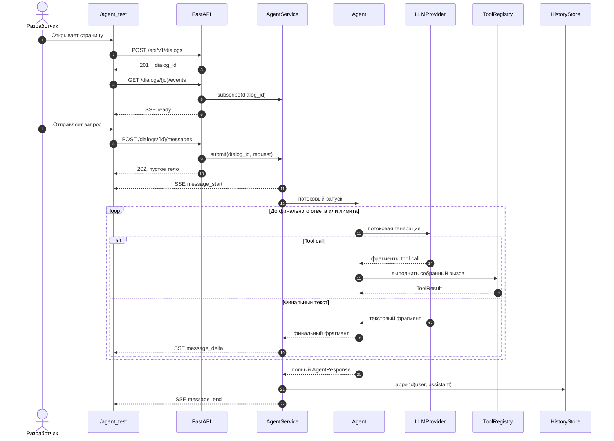

# Потоковые ответы агента через SSE и тестовый интерфейс

## Цель

Добавить клиенту возможность получать ответ агента по мере генерации через
Server-Sent Events (SSE), сохранив существующую асинхронную постановку сообщений
в очередь диалога. Одновременно предоставить встроенную диагностическую страницу
`/agent_test`: один самодостаточный HTML-документ с минимальным интерфейсом чата,
через который разработчик может создать диалог, отправить запрос и наблюдать
потоковый ответ без отдельного frontend-приложения.

Изменение развивает реализованные контракты
`specs/changes/agent-runtime/spec.md`,
`specs/changes/litellm-provider/spec.md` и
`specs/changes/agent-dialog-api/spec.md`. В части streaming и SSE требования
этой спецификации заменяют закреплённые в них ограничения первой версии.

## Допущения

- Под «потоковым выводом» понимается передача непустых фрагментов финального
  текста непосредственно во время потокового ответа LLM, а не разбиение уже
  готовой строки после завершения `Agent.run`.
- SSE предоставляется отдельной GET-ручкой диалога, совместимой с браузерным
  `EventSource`; существующая POST-ручка сообщения сохраняет пустой
  `202 Accepted` и не удерживает HTTP-соединение до завершения агента.
- SSE-подписка передаёт только будущие события текущего процесса. Она не
  является постоянным журналом, не восстанавливает пропущенные события после
  переподключения и не заменяет будущий API чтения истории.
- Одновременно к одному диалогу могут быть подключены несколько подписчиков;
  каждый активный подписчик получает одинаковые будущие события.
- Отключение всех SSE-клиентов не отменяет принятый запрос: агент продолжает
  работу, а успешный результат сохраняется в истории.
- В текущей версии нет аутентификации. Знание `dialog_id` по-прежнему не
  является надёжной авторизацией.
- `/agent_test` — инструмент ручной проверки backend, а не основной frontend и
  не отдельный сервис. Он работает с теми же публичными API-ручками, что и
  внешний клиент.
- Страница и API находятся на одном origin, поэтому CORS в это изменение не
  входит.

## Требования

- REQ-001: `LLMProvider` должен поддерживать асинхронную потоковую генерацию,
  которая передаёт текстовые фрагменты по мере их получения и позволяет
  однозначно получить завершённый доменный результат текущей итерации: финальный
  текст либо один полностью собранный tool call.
- REQ-002: `LiteLLMProvider` должен выполнять потоковый вызов только через
  `litellm.acompletion(..., stream=True)`, асинхронно обходить полученный поток и
  не использовать синхронный `completion`, Router, Proxy, callbacks или
  автоматическое выполнение инструментов.
- REQ-003: `LiteLLMProvider` должен корректно собирать фрагментированные поля
  одного tool call, включая идентификатор, имя и JSON-аргументы, до передачи
  завершённого вызова runtime. Tool call не исполняется провайдером.
- REQ-004: Пустой корректный финальный ответ должен поддерживаться потоком:
  отсутствие текстовых фрагментов завершается валидным финальным ответом с
  пустой строкой.
- REQ-005: Ошибка LiteLLM, ошибка чтения потока и некорректная либо смешанная
  последовательность внешних chunks должны преобразовываться в безопасную
  `LLMProviderError`. Текст внешнего исключения, запрос, ответ, tool payload и
  credentials не должны попадать в публичную ошибку или журнал. Отмена
  asyncio-задачи распространяется без преобразования.
- REQ-006: `FakeLLMProvider` и тестовые реализации потокового контракта должны
  работать детерминированно и без сети, в том числе позволять управляемо выдать
  несколько текстовых фрагментов, tool call, пустой ответ или ошибку.
- REQ-007: `Agent` должен предоставлять асинхронный поток выполнения, сохраняя
  существующий ограниченный tool-calling loop и API `Agent.run`. `Agent.run`
  должен возвращать тот же полный `AgentResponse`, который получается
  объединением фрагментов успешного потокового выполнения.
- REQ-008: В клиентский поток агента передаются только фрагменты финального
  ответа. Tool calls, аргументы и результаты инструментов, системный prompt,
  история и промежуточные сообщения agent loop клиенту не выдаются.
- REQ-009: На каждой итерации агент должен различать поток финального текста и
  поток единственного tool call. Завершённый tool call исполняется через
  `ToolRegistry`, его безопасный результат добавляется в рабочий контекст, после
  чего следующая итерация запускается по существующим правилам.
- REQ-010: Смешение финального текста и tool call, несколько tool calls,
  незавершённый tool call или другая некорректная последовательность должны
  завершать agent loop контролируемой ошибкой. Уже отправленные текстовые
  фрагменты могут быть отмечены последующим событием ошибки, но не считаются
  сохранённым ответом.
- REQ-011: `AgentService` должен публиковать жизненный цикл каждого запущенного
  запроса как упорядоченную последовательность доменных событий: начало ответа,
  ноль или более текстовых фрагментов, затем ровно одно успешное завершение либо
  безопасная ошибка.
- REQ-012: Для запросов одного диалога последовательности событий должны идти в
  том же порядке, что и существующая очередь: события следующего запроса не
  начинаются до терминального события предыдущего. Разные диалоги продолжают
  обрабатываться независимо.
- REQ-013: Успешное терминальное событие должно публиковаться только после
  атомарного сохранения пользовательского сообщения и полного ответа ассистента
  в `HistoryStore`. При ошибке или отмене история не изменяется, даже если часть
  текста уже была передана подписчикам.
- REQ-014: Отсутствие подписчиков, отключение подписчика или медленный
  подписчик не должны отменять agent loop, блокировать сохранение истории либо
  мешать другим диалогам. Ресурсы отключённого или переполненного подписчика
  освобождаются; политика ограниченной очереди и её размер определяются в плане.
- REQ-015: Должна существовать подписка на будущие события диалога. Подписка
  проверяет существование `dialog_id`, поддерживает независимых одновременных
  подписчиков и гарантированно удаляется при закрытии клиента или остановке
  приложения.
- REQ-016: `GET /api/v1/dialogs/{dialog_id}/events` должен возвращать
  `200 OK`, `Content-Type: text/event-stream` и `Cache-Control: no-cache`, сразу
  отправлять событие `ready`, а затем поддерживать соединение SSE до отключения
  клиента или остановки backend.
- REQ-017: SSE API должен использовать следующие именованные события, где
  каждое поле `data` содержит один валидный JSON-объект в UTF-8:
  - `ready` — `{"dialog_id":"<uuid>"}` после успешной подписки;
  - `message_start` — `{}` перед запуском обработки очередного запроса;
  - `message_delta` — `{"delta":"<непустой фрагмент>"}` для каждого
    фрагмента финального текста в исходном порядке;
  - `message_end` — `{}` после сохранения полного успешного ответа;
  - `message_error` — `{"code":"agent_error","message":"Agent request failed."}`
    при контролируемой ошибке или отмене запроса.
- REQ-018: Между прикладными событиями SSE-ручка должна периодически отправлять
  comment heartbeat, чтобы простаивающее соединение не выглядело зависшим и не
  закрывалось типичными HTTP-прокси. Heartbeat не является событием приложения
  и не отображается как сообщение.
- REQ-019: Для синтаксически некорректного UUID SSE-ручка должна вернуть
  `422 Unprocessable Entity`, для неизвестного или потерянного после перезапуска
  диалога — `404 Not Found`, а для уже остановленного сервиса — безопасный
  `503 Service Unavailable`; поток в этих случаях не открывается.
- REQ-020: SSE-события не сохраняются для replay. Заголовок `Last-Event-ID`
  можно игнорировать; переподключившийся клиент получает новое событие `ready` и
  только будущие события. Это ограничение должно быть явно описано в документации.
- REQ-021: Разрыв SSE-соединения не должен приводить к необработанным
  исключениям. При shutdown сервис прекращает приём запросов, закрывает
  подписки, отменяет оставшиеся agent tasks по существующему контракту и не
  оставляет фоновых задач.
- REQ-022: `POST /api/v1/dialogs/{dialog_id}/messages` должен сохранить текущий
  контракт: принять `{"request":"<непустой текст>"}`, поставить запрос в
  очередь и немедленно вернуть пустой `202 Accepted`, не ожидая первого SSE
  фрагмента или завершения агента.
- REQ-023: `GET /agent_test` должен возвращать `200 OK` и один статичный
  самодостаточный HTML-документ в UTF-8. Документ включает только встроенные
  HTML, минимальный CSS и vanilla JavaScript, не требует сборки, npm-пакетов,
  CDN, внешних шрифтов, изображений или других статических файлов.
- REQ-024: После загрузки `/agent_test` страница должна создать новый диалог
  через `POST /api/v1/dialogs`, открыть его SSE-подписку и явно показать
  пользователю состояния подключения, готовности, обработки и ошибки.
- REQ-025: Страница должна содержать читаемую область сообщений, многострочное
  поле ввода, кнопку отправки и действие создания нового диалога. Пустой ввод
  не отправляется; форма недоступна до события `ready` и во время обработки
  текущего запроса.
- REQ-026: После успешного `202 Accepted` страница отображает пользовательский
  текст. На `message_start` она создаёт сообщение ассистента, на каждом
  `message_delta` дописывает фрагмент без потери пробелов и переносов, на
  `message_end` завершает ответ, а на `message_error` явно помечает частичный
  ответ ошибочным и снова разрешает ввод.
- REQ-027: Ошибки создания диалога, открытия SSE и отправки POST должны быть
  видны на странице безопасным сообщением. Создание нового диалога должно
  закрывать прежний `EventSource`, очищать текущий transcript и не использовать
  cookie или локальное постоянное хранилище.
- REQ-028: Пользовательские запросы и ответы на тестовой странице должны
  вставляться в DOM как текст, без интерпретации HTML, чтобы вывод модели не мог
  выполнить произвольную разметку или script.
- REQ-029: Страница должна использовать относительные same-origin URL
  существующего API. Отдельный frontend-контейнер, CORS middleware и публичный
  API специально для тестовой страницы не добавляются.
- REQ-030: Логи runtime, провайдера, сервиса и SSE lifecycle должны содержать
  только стабильные имена событий, `dialog_id`, номера итераций, типы событий и
  ошибок. Текст запроса, фрагменты и полный ответ, история, tool payload и текст
  исключений в журнал не передаются.
- REQ-031: `docs/agent.md`, `docs/dialogs.md`, `docs/README.md`, backend README и
  корневой `AGENTS.md` должны быть обновлены по фактически реализованным
  streaming-, SSE- и `/agent_test`-контрактам. Документация должна отдельно
  отметить in-memory характер подписок и отсутствие replay.
- REQ-032: `make test` должен проверять потоковый runtime, LiteLLM-адаптер,
  прикладную публикацию событий, HTTP/SSE-контракт и поведение тестовой страницы
  детерминированно, без сети и внешней модели.

## Сценарии

### Потоковый ответ без инструмента

- Given диалог создан и SSE-клиент получил `ready`
- And тестовый LLM настроен выдать финальные фрагменты `"Привет"`, `", "` и
  `"Крош!"`
- When клиент отправляет корректный запрос в диалог
- Then POST немедленно возвращает пустой `202 Accepted`
- And SSE последовательно передаёт `message_start`, три `message_delta` и
  `message_end`
- And объединённый клиентом текст равен `"Привет, Крош!"`
- And история содержит исходный запрос и ровно этот полный ответ

### Вызов инструмента перед финальным ответом

- Given первый поток LLM содержит один фрагментированный tool call
- And инструмент успешно возвращает результат
- And второй поток LLM содержит финальные текстовые фрагменты
- When агент выполняет запрос
- Then клиент получает одно `message_start`
- And не получает имя, аргументы или результат инструмента
- And получает только `message_delta` второго потока и затем `message_end`
- And история содержит только пользовательское и полное финальное сообщения

### Пустой ответ

- Given LLM корректно завершает финальный ответ без текстовых фрагментов
- When запрос обработан
- Then SSE передаёт `message_start`, затем `message_end` без `message_delta`
- And в истории сохраняется пустое сообщение ассистента

### Ошибка после частичного текста

- Given агент уже передал один финальный текстовый фрагмент
- When чтение LLM-потока завершается контролируемой ошибкой
- Then SSE передаёт `message_error` и не передаёт `message_end`
- And частичный текст не сохраняется в истории
- And публичное событие и серверный журнал не раскрывают текст исключения

### Отключение подписчика

- Given запрос принят и агент генерирует поток
- When единственный SSE-клиент отключается
- Then подписка освобождается без необработанного исключения
- And агент продолжает обработку
- And успешный полный ответ сохраняется в истории
- And клиент, подключившийся позднее, получает `ready`, но не получает replay
  уже пропущенных событий

### Последовательность двух запросов

- Given в один диалог подряд приняты два запроса
- When первый запрос ещё выполняется
- Then события второго запроса не начинаются до `message_end` или
  `message_error` первого
- And после терминального события первого SSE передаёт отдельную
  последовательность, начинающуюся с `message_start`, для второго запроса

### Ручная проверка через `/agent_test`

- Given backend запущен командой `make run`
- When разработчик открывает `/agent_test`
- Then страница создаёт новый диалог, открывает SSE и показывает готовность
- When разработчик вводит запрос и отправляет форму
- Then запрос появляется в transcript после `202 Accepted`
- And ответ ассистента дополняется на странице по мере прихода
  `message_delta`
- And после `message_end` форма снова доступна для продолжения того же диалога

### Безопасный вывод HTML в тестовой странице

- Given запрос или ответ содержит HTML и JavaScript-подобный текст
- When страница отображает сообщение
- Then содержимое видно как обычный текст
- And разметка или script из сообщения не исполняются

## Поток взаимодействия

## Технологии и структура

- Python 3.12, `uv`, FastAPI, Starlette streaming primitives, Pydantic, LiteLLM
  Python SDK и Pytest.
- Потоковые доменные типы и контракты остаются внутри
  `backend/src/smeshariki_ai/agent/`; они не зависят от FastAPI или SSE.
- Управление подписчиками и преобразование agent stream в события диалога
  относятся к application-слою. Он не форматирует SSE и не импортирует FastAPI.
- HTTP-слой в `backend/src/smeshariki_ai/api/` преобразует доменные события в
  SSE frames и отдаёт самодостаточный `/agent_test` HTML.
- Для SSE не вводится отдельный брокер, база событий или сторонний SSE-сервис:
  подписки и ограниченные очереди живут в памяти процесса.
- HTML может храниться отдельным исходным `.html`-файлом внутри backend-пакета
  либо как package resource; в любом варианте клиент получает ровно один
  самодостаточный документ без дополнительных статических запросов. Конкретное
  размещение выбирается на этапе plan.
- Существующие `AgentConfig` и `LiteLLMProviderConfig` не получают настроек
  HTTP heartbeat или subscriber queue: инфраструктурные параметры SSE, если
  понадобятся, принадлежат HTTP/application composition, а не runtime агента.
- Frontend остаётся вне Docker Compose. `/agent_test` обслуживается тем же
  backend-контейнером и не считается верхнеуровневым frontend-компонентом.

## Команды

- Запуск: `make run` из корня репозитория.
- Тесты: `make test` из корня репозитория.
- Линтинг: `make lint`.
- Форматирование: `make format`.

## Тестирование

| Требования | Способ проверки |
| --- | --- |
| REQ-001–REQ-006 | Модульные async-тесты потокового контракта, LiteLLM chunks, сборки tool call, пустого результата, безопасных ошибок и отмены |
| REQ-007–REQ-010 | Модульные тесты agent loop на текстовые фрагменты, tool call, совместимость `run`, пустой ответ и некорректные смешанные потоки |
| REQ-011–REQ-015 | Модульные async-тесты `AgentService` на порядок событий, сохранение перед завершением, ошибки, несколько подписчиков, disconnect и медленного подписчика |
| REQ-016–REQ-022 | HTTP/SSE-тесты FastAPI на media type, cache header, точный порядок и JSON событий, heartbeat, 404/422/503, reconnect без replay, shutdown и неизменный пустой `202` |
| REQ-023–REQ-029 | HTTP-тест единственного HTML-ответа и браузерная ручная проверка создания диалога, отправки, постепенного вывода, ошибок и нового диалога; безопасность DOM дополнительно проверяется ревью JavaScript без искусственного теста наличия тегов |
| REQ-030 | Тесты с перехватом логов для успешного потока, ошибки и disconnect; приватные маркеры не должны встречаться в логе |
| REQ-031 | Ревью архитектурной документации, backend README и `AGENTS.md`; отдельные тесты существования документации не добавляются |
| REQ-032 | Полный `make test` с детерминированными doubles без сети |

Потоковые тесты обязаны синхронизироваться через управляемые async-события, а
не через произвольные задержки. Для HTTP/SSE допускается тестовый ASGI-клиент,
который читает frames постепенно и доказывает, что первый fragment доступен до
разрешения генерации следующего. Heartbeat проверяется с внедряемым коротким
интервалом или контролируемым источником времени, чтобы тесты оставались
быстрыми и детерминированными.

## Границы

- Всегда: передавать реальные фрагменты финальной генерации; сохранять полный
  ответ только после успеха; соблюдать очередь одного диалога; очищать
  подписчиков; экранировать вывод тестовой страницы; не журналировать контент.
- Сначала спросить: менять пустой `202` или тела существующих API-ответов;
  добавлять replay, историю по HTTP, постоянный event store, идентификаторы
  запросов в публичный контракт, аутентификацию, CORS или внешний frontend.
- Никогда: выдавать через SSE tool calls, tool results, prompt или историю;
  исполнять инструмент в LLM-провайдере; блокировать завершение агента из-за
  медленного клиента; загружать ресурсы `/agent_test` из CDN; интерпретировать
  модельный текст как HTML; добавлять frontend в Docker Compose.

## Критерии приёмки

- [ ] Клиент получает первый реальный фрагмент финального ответа до завершения
  всей генерации LLM, а полный текст после объединения фрагментов совпадает с
  сохранённым сообщением ассистента.
- [ ] Tool calling продолжает работать в потоковом agent loop, но сведения об
  инструментах не появляются в SSE.
- [ ] Пустой ответ, ошибка после частичного текста, disconnect, медленный
  подписчик и shutdown завершаются по описанным контрактам без повреждения
  истории или утечки фоновых задач.
- [ ] `GET /api/v1/dialogs/{dialog_id}/events` выдаёт `ready`, упорядоченные
  `message_*` events и heartbeat с установленными SSE-заголовками.
- [ ] Несколько активных подписчиков видят одинаковые будущие события, а
  переподключение не воспроизводит пропущенные события.
- [ ] `POST /api/v1/dialogs/{dialog_id}/messages` по-прежнему немедленно
  возвращает пустой `202 Accepted`.
- [ ] `/agent_test` — один self-contained HTML, который создаёт диалог,
  подключает SSE, отправляет сообщения и постепенно выводит безопасный текст
  ответа без внешних ресурсов.
- [ ] Архитектурная документация и `AGENTS.md` отражают реализованные SSE,
  streaming, `/agent_test`, in-memory ограничения и отсутствие replay/CORS.
- [ ] `make test` и `make lint` проходят успешно без сети и внешней модели.

## Открытые вопросы

- Нет. Имена событий, endpoint, отсутствие replay и сохранение пустого `202`
  считаются предлагаемым контрактом этой спецификации и требуют явного
  одобрения перед переходом к plan.
